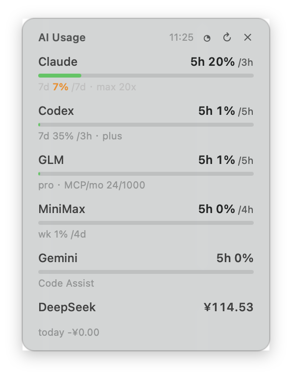
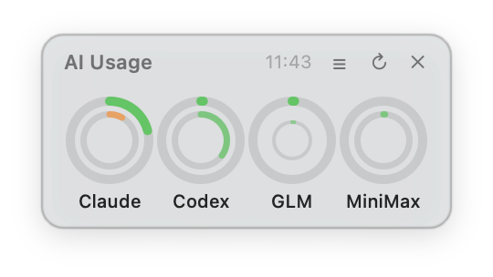

# usage-monitor

A native macOS always-on-top floating panel showing usage across your AI subscriptions — Claude, Codex, Gemini, GLM, MiniMax, DeepSeek — in one glance.

| List mode | Ring mode |
|---|---|
|  |  |

## Why

Figuring out *"which AI should I use right now"* shouldn't be a query task — it should be peripheral vision.

- **Availability, not usage.** Raw percentages don't carry a decision. The panel shows what's left and how long until it comes back (adaptive single-unit countdowns: `3d`, `4h`, `45m`), and pace-based colors answer the only question that matters: *at this burn rate, will the window survive until reset?* Green = go ahead, red = ease off.
- **Visual hierarchy mirrors information hierarchy.** The 5h window is what you act on — big, bold, bar / outer ring. Countdowns are smaller and dimmer. Weekly windows, MCP quotas and plan tiers are fine print / thinner inner rings. No icons, no decoration.
- **Ambient, not an app.** Always-on-top vibrancy panel, no Dock icon, never steals focus, auto-refreshes, remembers its position and view mode. Like the menu-bar clock: always there, always current, never managed.
- **Zero maintenance.** Credentials are reused from the CLIs you already log into; expired OAuth tokens refresh themselves. Install it, then forget it exists — except for the colors.

**Six subscriptions, one glance, zero maintenance.**

## Features

- **Zero config**: reuses credentials your CLIs already saved (Claude Code keychain, `~/.codex/auth.json`, `~/.gemini/oauth_creds.json`, opencode/hermes auth files). Providers without credentials are hidden automatically.
- **Self-healing OAuth**: expired Codex / Gemini access tokens are silently refreshed via their refresh tokens and written back — no more re-running CLIs just to query usage.
- **Pace coloring**: window color reflects burn rate vs. reset time (green = sustainable … red = will exhaust before reset), same algorithm as the Claude Code statusline.
- **Two complementary views**, deliberately different: the **list** carries the numbers (exact percentages, reset countdowns, plan & quota fine print); the **ring strip** is a compact single-row, pure-graphic glance at your top-4 providers — arcs and pace colors only (outer = 5h window, inner = 7d/weekly, smallest = monthly MCP quota), hover for details. Toggle with `◔`/`☰`; mode and window position persist.
- Native NSPanel + vibrancy, no Dock icon, auto-refresh every 5 min, `↻` for manual refresh, hover for details.

## Install

```bash
git clone https://github.com/08mamba24/usage-monitor && cd usage-monitor
./install.sh        # compiles, starts, enables login autostart
```

Requirements: macOS 13+, Xcode Command Line Tools (`xcode-select --install`). No other dependencies — plain `swiftc` + system Python 3.

## Providers & credential sources

| Provider | Shows | Credentials from |
|---|---|---|
| Claude (Max/Pro) | 5h + 7d windows, plan & tier | macOS Keychain (Claude Code login) |
| Codex (ChatGPT) | 5h + 7d windows, plan | `~/.codex/auth.json`, auto-refreshed |
| Gemini (Code Assist) | quota used | `~/.gemini/oauth_creds.json`, auto-refreshed |
| GLM (z.ai coding plan) | 5h window, monthly MCP quota | `GLM_API_KEY` / opencode / hermes |
| MiniMax coding plan | 5h + weekly windows | `MINIMAX_API_KEY` / opencode / hermes |
| DeepSeek (prepaid) | balance + today's spend | `DEEPSEEK_API_KEY` / opencode |

API-key providers can be configured explicitly — see [`env.example`](env.example) → `~/.config/usage-monitor/env`.

## Privacy & security

- **No tokens in this repo or its output.** Credentials are read at runtime from your local credential stores; the JSON cache contains only percentages and balances.
- The only embedded constant is the **public installed-app OAuth client ID** of codex CLI (the same one shipped in every copy of that open-source CLI); gemini-cli's client constants are extracted at runtime from your local gemini installation. Both are needed because refresh tokens are bound to the client that issued them.
- Everything talks directly to the official provider endpoints; nothing else is contacted.

## Uninstall

```bash
./install.sh --uninstall   # removes launchd agent; your credentials are untouched
```

## License

MIT
